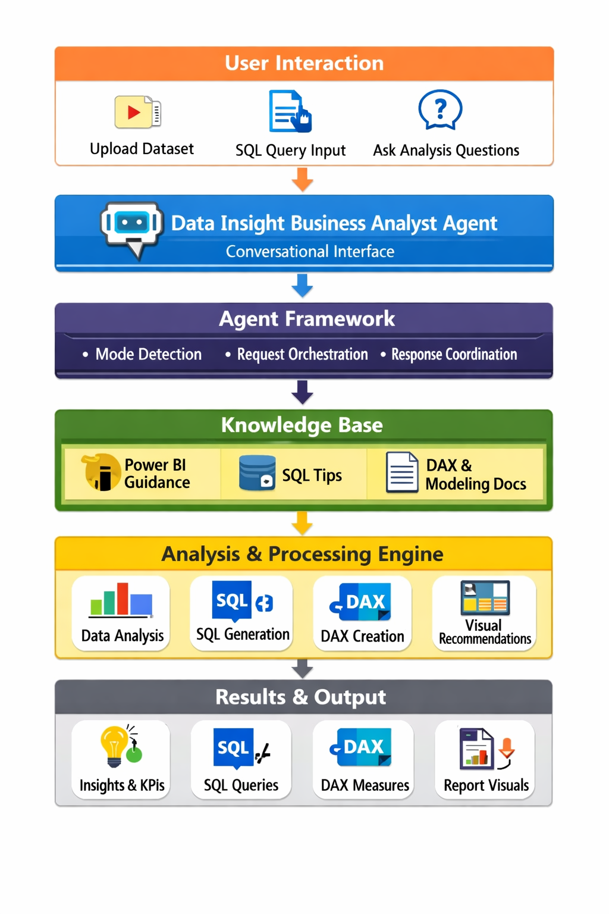

# data-insight-business-analyst
AI-powered analytics copilot that combines SQL analysis, Power BI guidance, KPI development, dashboard recommendations, and business insight generation.
# Data Insight Business Analyst – AI Analytics Copilot

## Overview

Data Insight Business Analyst is an AI-powered analytics assistant that helps users transform raw data into actionable business insights. The agent combines SQL expertise, Power BI guidance, KPI development, dashboard recommendations, and exploratory data analysis into a single conversational experience.

Users can provide datasets, SQL queries, report screenshots, KPI definitions, or business questions, and the agent delivers practical recommendations that can be applied immediately.

## Features

- SQL Query Generation
- SQL Query Debugging
- Power BI Dashboard Recommendations
- DAX Measure Suggestions
- KPI and Metric Development
- Data modeling guidance
- Trend and anomaly detection
- Data Quality assessment
- Exploratory Data Analysis (EDA)
- Business Insight Generation

## How It Works

1. User provides a business question, dataset, SQL query, or reporting requirement.
2. The agent identifies the analysis objective and available inputs.
3. The agent reviews the data, logic, or reporting requirements.
4. The agent generates recommendations, explanations, and actionable insights.
5. The user receives guidance that can be immediately applied in SQL, Power BI, or business reporting workflows.

## Example Use Cases

### SQL Analysis
Generate SQL queries from business requirements
Debug SQL errors
Optimize query performance
Explain joins, subqueries, CTEs, and window functions

### Power BI Support
Recommend dashboard layouts
Suggest KPIs and metrics
Create DAX measures
Improve data models and relationships
Recommend visuals and reporting structures

### Dataset Analysis
Profile datasets
Identify missing values and quality issues
Detect trends and anomalies
Generate business insights and recommendations

### Business Value
Reduces time spent writing and debugging SQL queries
Accelerates Power BI dashboard development
Improves data quality awareness
Helps users uncover insights faster
Supports data-driven decision-making

## Architecture
User → Data Insight Business Analyst Agent

The agent routes requests through:

SQL Analysis Engine
Power BI Advisory Engine
Data Profiling & EDA Layer
Insight Generation Layer

The output is delivered as actionable recommendations, queries, KPIs, dashboards, and business insights.

## Documentation

Additional project documentation:

- 📄 [Project Description](docs/project-description.md)
- 📋 [Use Cases](docs/use-cases.md)

## Architecture

## 🎥 Demo Video
Watch the full demo here:  
[https://youtu.be/YOUR-VIDEO-LINK](https://youtu.be/zIKuvuMEnHM)

## Author

Mahwish Farhan
